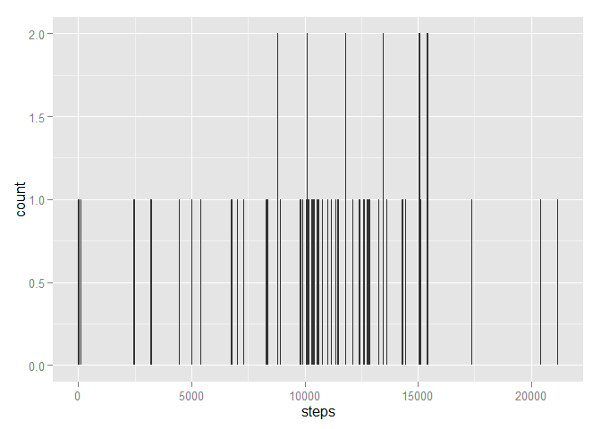
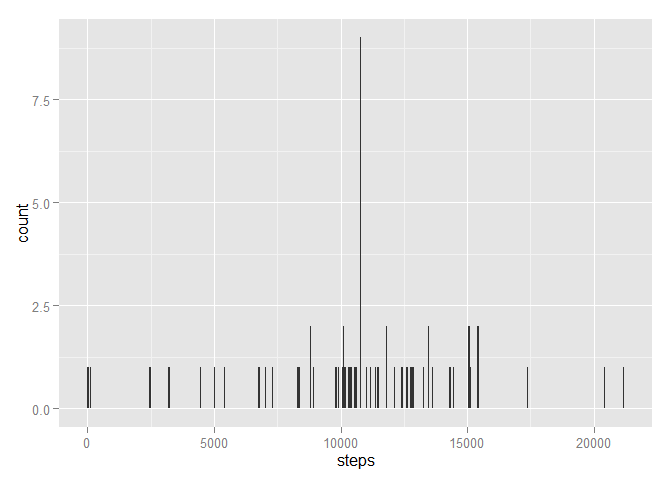

# Reproducible Research: Peer Assessment 1


## Loading and preprocessing the data
You need to download 'activity.zip' to local folder.
Load data from your local folder.

```r
unzip('activity.zip')
actData <- read.csv("./activity.csv",header=TRUE)
```

## What is mean total number of steps taken per day?

```r
library(ggplot2)
sumStepPerDay<-aggregate(actData$steps,by=list(actData$date),FUN=sum)
colnames(sumStepPerDay)<- c("date","steps")
```
Histogram of the total number of steps taken each day , mean , median.

```r
qplot(steps, data=sumStepPerDay, geom="histogram",binwidth=50)
```

 

```r
mean(sumStepPerDay$steps,na.rm=TRUE)
```

```
## [1] 10766.19
```

```r
median(sumStepPerDay$steps,na.rm=TRUE)
```

```
## [1] 10765
```

## What is the average daily activity pattern?
Time Series plot of the 5-minute interval (x-axis) and the average number of steps taken, averaged across all days (y-axis)

```r
stepByInterval<-aggregate(actData$steps,by=list(actData$interval),FUN=mean,na.rm=TRUE)
colnames(stepByInterval)<- c("interval","steps")
qplot(interval,steps, data=stepByInterval, geom="line")
```

 

Which 5-minute interval, on average across all the days in the dataset, contains the maximum number of steps?


```r
stepByInterval$interval[which.max(stepByInterval$steps)]
```

```
## [1] 835
```
## Imputing missing values
Total number of missing values in the dataset

```r
sum(is.na(actData$steps))
```

```
## [1] 2304
```

Filling in all of the missing values in the new dataset (actDataOK) with mean for that 5-minute interval.


```r
actDataOK <- actData
for(r in 1:nrow(actDataOK)){
  if (is.na(actDataOK$steps[r])) {
    repl <- stepByInterval$steps[stepByInterval$interval == actDataOK$interval[r]]
    actDataOK$steps[r] <- repl
  }
}


sumStepPerDayOK<-aggregate(actDataOK$steps,by=list(actDataOK$date),FUN=sum)
colnames(sumStepPerDayOK)<- c("date","steps")
qplot(steps, data=sumStepPerDayOK, geom="histogram",binwidth=50)
```

 

```r
mean(sumStepPerDayOK$steps,na.rm=TRUE)
```

```
## [1] 10766.19
```

```r
median(sumStepPerDayOK$steps,na.rm=TRUE)
```

```
## [1] 10766.19
```
Mean and Median are differ very low.
The impact of imputing missing data on the estimates of the total daily number of steps is very low.

## Are there differences in activity patterns between weekdays and weekends?

```r
actDataOK$day <- "weekday"
actDataOK$day[weekdays(as.Date(actDataOK$date), abb=T) %in% c("Sat","Sun")] <- "weekend"

stepByIntervalOK <- aggregate(steps ~ interval + day, data=actDataOK, FUN="mean")
library(lattice)
xyplot(steps ~ interval | day, data=stepByIntervalOK, type="l", grid=T, layout=c(1,2), ylab="Number of steps", xlab="5 minutes intervals", main="Average  5 minutes intervals: Weekday VS Weekend")
```

 
Weekends seem more step more activity than weekdays.


